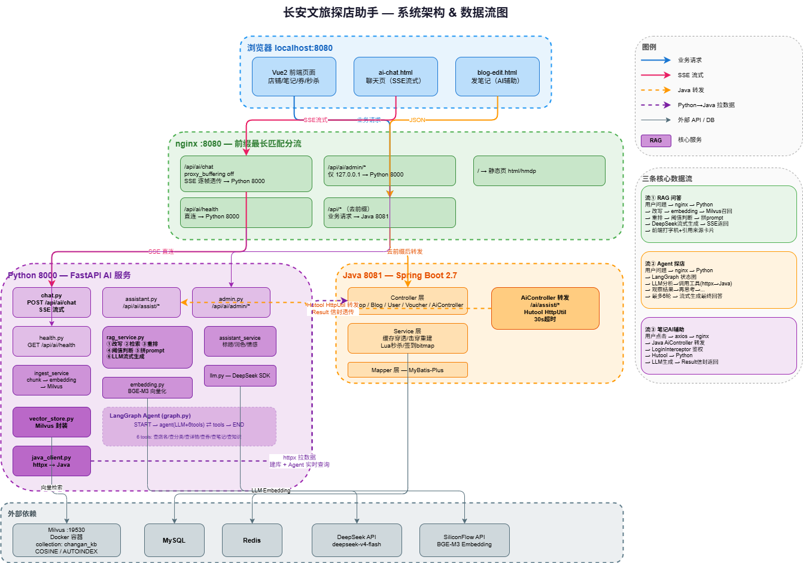
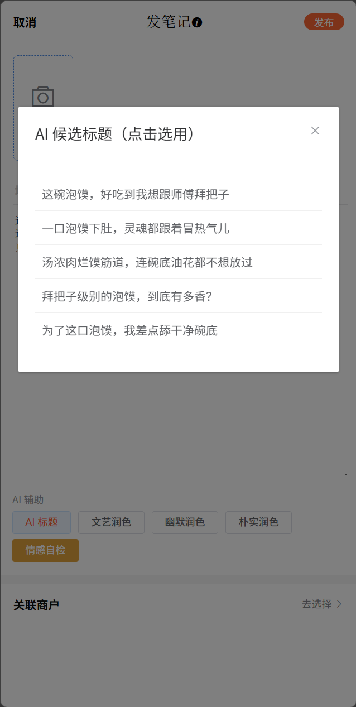
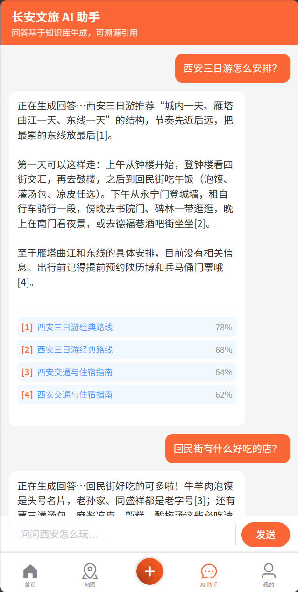
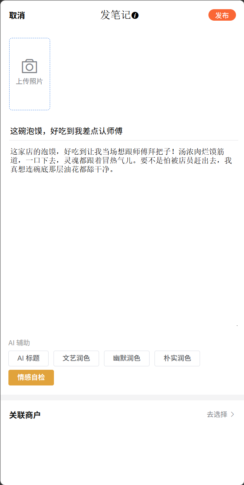
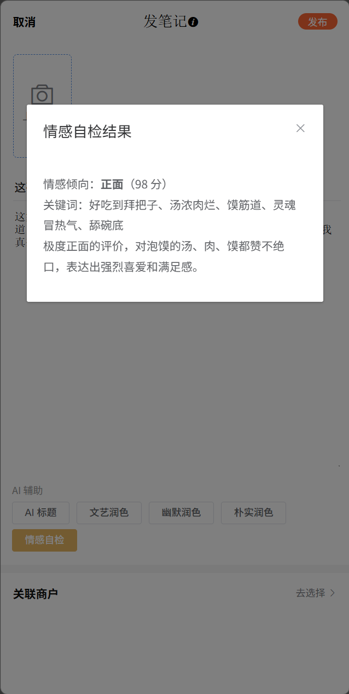
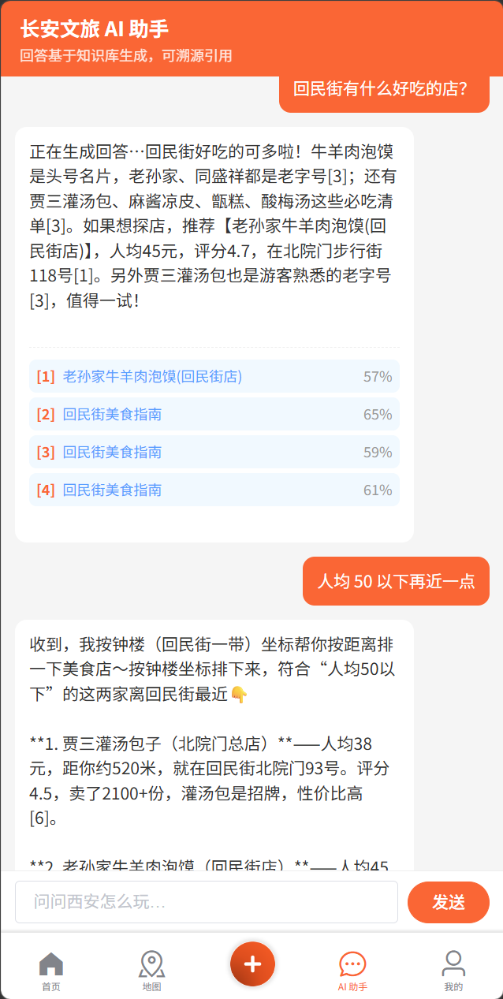

<p align="center">
  
</p>

<h1 align="center">🏮 长安文旅探店助手</h1>
<p align="center">
  <strong>Java + Python 双栈 AI 探店平台</strong><br>
  以 Spring Boot 点评平台（这部分本文不做详细说明，详见黑马点评项目）为底座，叠加 DeepSeek 大模型 + LangGraph Agent + Milvus 向量检索<br>
  打造长安（西安）文旅场景下的智能问答、探店笔记 AI 辅助与智能推荐 Agent
</p>

<p align="center">
  
  
  
  
  
  
  
  
  
</p>

---

## 📖 目录

- [💡 一句话介绍](#-一句话介绍)
- [✨ 核心亮点](#-核心亮点)
- [🎬 演示剧本与截图](#-演示剧本与截图)
- [🏗 系统架构](#-系统架构)
- [📂 项目结构](#-项目结构)
- [🚀 快速开始](#-快速开始)
- [📡 接口设计](#-接口设计)
- [🧠 核心功能深度解析](#-核心功能深度解析)
- [🗺 开发路线图](#-开发路线图)
- [📚 面试知识点](#-面试知识点)

---

## 💡 一句话介绍

> 在 Spring Boot 点评平台之上，用 **FastAPI + LangGraph + Milvus** 构建 **RAG 智能问答**与**工具调用 Agent**，通过 **nginx 网关分流**实现 Java/Python 双栈异构集成，**SSE 流式输出**，回答可溯源引用。

---

## ✨ 核心亮点

<table>
<tr>
<td width="50%">

### 🔍 长安文旅智能问答（RAG）
以西安文旅知识库 + 平台实时店铺/笔记数据为语料，流式回答旅行问题，**回答带引用来源**，一键跳转详情页。

> *"西安三日游怎么安排？"*
> *"回民街有什么好吃的？"*

</td>
<td width="50%">

### 🤖 探店智能 Agent
多轮对话中自主调用 6 个工具（查店铺/分类/详情/优惠券/笔记/知识），完成复合任务。

> *"帮我找钟楼附近人均 80 以下的美食店，再看看有没有优惠券"*

</td>
</tr>
<tr>
<td width="50%">

### ✍️ 探店笔记 AI 辅助
一键生成候选标题、按风格润色正文、情感分析自检 + 评论区舆情监控。

> *文艺 / 幽默 / 朴实 三种风格随心切换*

</td>
<td width="50%">

### 🎯 RAG 检索 Hit@5=100%
基于 bge-m3 向量 + jieba 关键词 + MMR 重排的混合检索，20 组标注 QA 实测 **Hit@5=100%、MRR=0.967**。

</td>
</tr>
</table>

---

## 🎬 演示剧本与截图

| 场景 | 对话示例 | 涉及技术 |
|------|----------|----------|
| 🗺 **RAG 知识问答** | 「西安三日游怎么安排？」 | 向量检索 → 重排 → 流式生成 → 引用来源 |
| 🍜 **Agent 探店** | 「回民街有什么好吃的店？」 | 意图路由 → 查店名 → 查优惠券 |
| 🧭 **多轮距离排序** | 「人均 50 以下再近一点」 | 多轮改写 → 查分类 + 坐标距离排序 |
| ✍️ **AI 辅助发笔记** | 生成标题（5选1）→ 润色 → 情感自检 | 标题生成 / 风格润色 / 情感分析 |
| 📊 **管理后台** | `GET /api/ai/admin/status` | 向量库规模与来源分布 |

<table>
<tr>
<td width="33%" align="center">
  <strong>🏠 应用首页</strong><br><br>
  
</td>
<td width="33%" align="center">
  <strong>📝 AI 候选标题（5选1）</strong><br><br>
  
</td>
<td width="33%" align="center">
  <strong>🗺 AI 智能问答（RAG 流式回答带引用来源）</strong><br><br>
  
</td>
</tr>
<tr>
<td width="33%" align="center">
  <strong>✨️ AI 风格润色</strong><br><br>
  
</td>
<td width="33%" align="center">
  <strong>🎭 情感自检</strong><br><br>
  
</td>
<td width="33%" align="center">
  <strong>🤖 Agent 多轮对话（工具调用 + 距离排序）</strong><br><br>
  
</td>
</tr>
</table>

---

## 🏗 系统架构

### 数据流全景图

```
              浏览器 localhost:8080
               │
               ├─ 静态页 /                          → nginx 静态资源
               ├─ /api/*（业务请求）                  → nginx → Java 8081
               ├─ /api/ai/chat|health|admin         → nginx 直连 Python 8000 ⚡ SSE 流式
               └─ /api/ai/assist/*（笔记AI辅助）      → Java 8081 → 转发 Python 8000
                                                          │
                      Python 8000 ──── httpx ────→ Java 8081（拉数据建库 + Agent 工具实时查询）
                            │
                            ├─ DeepSeek API（对话/生成/function calling）
                            ├─ SiliconFlow API（bge-m3 embedding）
                            └─ Milvus Docker（127.0.0.1:19530 gRPC | :9091 HTTP 探活）
```

### 三大核心架构决策

| # | 决策 | 为什么 | 技术细节 |
|---|------|--------|----------|
| 1 | **流式走 nginx 直连，非流式走 Java 转发** | RestTemplate 基于 HttpURLConnection 会整体缓冲，SSE 会被吞成"等 20 秒一次性吐全文" | nginx `proxy_buffering off` 逐帧透传；前缀最长匹配天然分流，同源 8080 无 CORS |
| 2 | **Python 不直连 MySQL** | 规避内网连通性风险，Python 定位为"Java 之上的智能层" | 所有数据经 Java REST API 获取，httpx 异步调用 |
| 3 | **统一返回体 `{success, errorMsg, data, total}`** | 前端拦截器只认 `success` 字段，一条链路三种语言格式统一 | Python 模仿 Java `Result` 信封，Java 转发零改造透传 |

---

## 📂 项目结构

```
chang_an_travel/
├──  README.md
├── 🖼 数据流图.png
│
├── 📁 chang_an_ai/                    # 🐍 Python AI 服务（FastAPI, port 8000）
│   ├── run.py                         #   启动入口
│   ├── requirements.txt               #   Python 依赖
│   ├── .env                           #   API Key 配置
│   ├── app/
│   │   ├── main.py                    #   FastAPI 入口 + lifespan 懒加载向量库
│   │   ├── config.py                  #   pydantic-settings 配置管理
│   │   ├── routers/                   #   🌐 路由层
│   │   │   ├── chat.py                #     SSE 流式聊天（RAG/Agent/auto 意图路由）
│   │   │   ├── assistant.py           #     笔记 AI 辅助（标题/润色/情感）
│   │   │   ├── admin.py               #     知识库管理（仅 127.0.0.1）
│   │   │   └── health.py              #     健康检查
│   │   ├── services/                  #   🧠 业务逻辑层
│   │   │   ├── llm.py                 #     DeepSeek 对话/生成接口
│   │   │   ├── embedding.py           #     bge-m3 向量化
│   │   │   ├── rag_service.py         #     RAG 检索+生成编排
│   │   │   ├── agent_service.py       #     LangGraph Agent 编排
│   │   │   ├── assistant_service.py   #     笔记 AI 辅助
│   │   │   ├── ingest_service.py      #     知识库入库
│   │   │   ├── chunking.py            #     文档分块策略
│   │   │   ├── query_rewrite.py       #     多轮查询改写
│   │   │   ├── reranker.py            #     重排序（jieba+MMR）
│   │   │   └── session_store.py       #     会话管理
│   │   ├── repositories/              #   🗄 数据访问层
│   │   │   ├── vector_store.py        #     Milvus 向量库封装
│   │   │   └── java_client.py         #     httpx 调用 Java API
│   │   ├── agent/                     #   🤖 Agent 模块
│   │   │   ├── state.py               #     LangGraph 状态定义
│   │   │   ├── graph.py               #     状态图（agent ⇄ tools）
│   │   │   └── tools.py               #     6 个工具函数
│   │   ├── prompts/                   #   💬 提示词模板
│   │   │   ├── rag.py                 #     RAG 回答 prompt
│   │   │   ├── rewrite.py             #     查询改写 prompt
│   │   │   ├── agent.py               #     Agent system prompt
│   │   │   └── assistant.py           #     标题/润色/情感 prompt
│   │   └── data/                      #   📊 数据资源
│   │       ├── corpus/                #     西安文旅语料（景点/美食/攻略）
│   │       └── sql/                   #     西安种子数据 SQL
│   ├── scripts/                       #   🔧 工具脚本
│   │   ├── ingest.py                  #     知识库建库
│   │   ├── eval_retrieval.py          #     检索效果评估
│   │   └── demo_check.sh              #     一键探活
│   └── tests/                         #   ✅ pytest 测试（fake LLM/embedding + respx mock）
│
└── 📁 chang_an_backend/               # ☕ Java 后端 + nginx 网关
    ├── chang_an_dianping/              #   Spring Boot 2.7.18（port 8081）
    │   └── src/main/java/com/hmdp/
    │       ├── controller/             #     店铺/笔记/用户/优惠券/AI 转发
    │       ├── service/                #     缓存穿透/击穿/秒杀/签到/分布式锁
    │       └── utils/                  #     Redis token/拦截器/全局 ID
    └── nginx-1.18.0/                   #   nginx + 前端静态页（port 8080）
```

---

## 🚀 快速开始

### 环境要求

| 组件 | 版本 | 用途 |
|------|------|------|
| Java | 17+ | Spring Boot 后端 |
| Python | 3.11 | AI 服务 |
| MySQL | 8.0 | 业务数据 |
| Redis | 7.x | 缓存/Token/分布式锁 |
| Docker | 20+ | Milvus 向量数据库 |
| nginx | 1.18 | 网关 + 静态资源 |

### 1️⃣ 启动基础设施

```bash
# MySQL + Redis 就绪后启动 Java 后端（8081）

# 启动 Milvus 向量数据库
docker start milvus-standalone
# 首次部署：
# docker run -d --name milvus-standalone -p 19530:19530 -p 9091:9091 milvusdb/milvus:v3.0.0

# 验证 Milvus 就绪
curl http://127.0.0.1:9091/healthz   # 返回 OK
```

### 2️⃣ 启动 Python AI 服务

```bash
cd chang_an_ai

# 创建虚拟环境
conda create -p .venv python=3.11 -y
conda activate .venv

# 安装依赖
pip install -r requirements.txt

# 配置 API Key
cp .env.example .env
# 编辑 .env 填入 DEEPSEEK_API_KEY 和 SILICONFLOW_API_KEY

# 构建知识库
python scripts/ingest.py

# 启动服务（8000 端口）
python run.py
```

### 3️⃣ 启动 nginx 网关

```bash
cd chang_an_backend/nginx-1.18.0
start nginx.exe
# 或双击 nginx.exe
```

### 4️⃣ 打开浏览器

```
http://localhost:8080 → 点击底部「AI 助手」tab 开始体验 🎉
```

---

## 📡 接口设计

### Python AI 服务（FastAPI, Port 8000）

| 方法 | 路径 | 说明 | 流式 |
|------|------|------|:----:|
| `GET` | `/api/ai/health` | 健康检查，返回 `{status, kb_count, models}` | |
| `POST` | `/api/ai/chat` | 聊天统一入口，`mode: rag\|agent\|auto` 意图路由 | ⚡ SSE |
| `POST` | `/api/ai/assist/title` | 生成 5 个候选标题 | |
| `POST` | `/api/ai/assist/polish` | 按风格润色（文艺/幽默/朴实） | |
| `POST` | `/api/ai/assist/sentiment` | 情感分析（发帖自检 / 评论区舆情） | |
| `POST` | `/api/ai/admin/ingest` | 重建知识库（仅 127.0.0.1） | |
| `GET` | `/api/ai/admin/status` | 向量库状态（仅 127.0.0.1） | |

### 鉴权设计

```
前端 token（sessionStorage）
    │
    ├─ /api/ai/assist/* → Java 转发 → 需登录（/ai/** 不在白名单）
    │   语义：发笔记需登录 → AI 辅助也需登录
    │
    └─ /api/ai/chat → nginx 直连 Python → 对内不设防
        靠网络边界：nginx 只暴露 chat/health，admin 仅 127.0.0.1
```

---

## 🧠 核心功能深度解析

### 1. RAG 智能问答（多源知识库）

```
📥 入库链路
  corpus 语料（md 按二级标题 400-600 字 + overlap 80）
  + 店铺/笔记/券（一条记录一个 chunk）
  → bge-m3 embedding（1024 维）
  → Milvus collection: changan_kb（COSINE 度量，AUTOINDEX）

📤 查询链路
  用户问题 → 多轮 query 改写（LLM + 启发式短路）
  → embedding → 召回 Top8
  → 重排 Top4（jieba 关键词 + 类型商圈匹配 + 质量分 + MMR）
  → 拼 prompt → DeepSeek 流式生成 → SSE 推送给前端

🛡 防幻觉三板斧
  ① prompt 强制「知识库没有就明说」
  ② score < 0.35 阈值兜底，不进 LLM
  ③ 句末 [1][2] 引用标注，前端渲染「参考来源」卡片可点击跳转
```

### 2. 探店 Agent（LangGraph）

```
状态图:  START → agent(LLM+tools) → 条件边 → tools(ToolNode) ⇄ agent → END
         max_iter=6 防死循环，astream_events v2 流式

🛠 6 个工具:
  ┌──────────────┬────────────────────────────────┐
  │ 工具          │ 数据来源                        │
  ├──────────────┼────────────────────────────────┤
  │ 查店名        │ Java API 实时查询               │
  │ 查分类(带坐标) │ Java API + Redis GEO 距离排序   │
  │ 查详情        │ Java API 实时查询               │
  │ 查优惠券      │ Java API 实时（库存实时变化）    │
  │ 查笔记        │ 本地向量库（source=blog 过滤）   │
  │ 查知识        │ 本地向量库（source=corpus 过滤） │
  └──────────────┴────────────────────────────────┘

🛡 工具失败兜底: 捕获异常 → 返回结构化错误文本给 LLM → 换策略重试
```

### 3. 笔记 AI 辅助

| 功能 | 输入 | 输出 | 风格选项 |
|------|------|------|----------|
| 📝 标题生成 | 笔记正文 + 店铺名 | 5 个候选标题（前端点选回填） | - |
| ✨ 风格润色 | 原始文本 | 润色后文本 | 文艺 / 幽默 / 朴实 |
| 🎭 情感分析 | 单条文本 / 评论列表 | `{sentiment, score, keywords, summary}` | - |

---

## 🗺 开发路线图

> 6 周业余时间，7 个阶段，从零搭建完整 AI 应用

| 阶段 | 内容 | 核心交付 | ✅ |
|:--:|------|------|:--:|
| 0 | 骨架搭建：conda 环境、分层目录、配置、健康检查 | `curl health` 通 | ✅ |
| 1 | 数据管道：java_client 拉数、西安语料、embedding、入库 | Milvus 千级 chunk | ✅ |
| 2 | RAG 问答：检索→重排→prompt→流式生成、多轮改写 | 脚本可流式问答带引用 | ✅ |
| 3 | 前端聊天页：ai-chat.html SSE 解析、nginx 分流 | **浏览器可流式演示** | ✅ |
| 4 | 笔记 AI 辅助：Python 三接口 + Java AiController | 发笔记可用 AI 辅助 | ✅ |
| 5 | 探店 Agent：LangGraph 状态图、6 工具、意图路由 | 多轮 Agent 演示 | ✅ |
| 6 | 长安数据落地：西安 SQL（18店/12笔记/20券）、全链路验证 | 全站西安化 | ✅ |
| 7 | 测试文档：pytest 22 用例、Hit@5=100% 评估 | 检索命中率报告 | ✅ |

---

## 📚 面试知识点

> 这个项目涉及的知识点覆盖了**大模型应用开发、系统架构、数据工程**三个维度，以下是按专题整理的面试要点。

<details>
<summary><strong>🔍 RAG 专题</strong></summary>

- **两条链路**：入库（chunk→embedding→向量库）与查询（改写→embedding→召回 top8→重排 top4→拼 prompt→流式生成）
- **chunk 策略**：结构化记录一条一 chunk（原子语义单元）；md 按标题切保证语义完整；切太碎丢上下文、切太大稀释向量
- **余弦 vs 欧氏**：语义检索用 cosine（方向而非长度），店铺距离排序是地理欧氏距离，两个场景别混
- **防幻觉三板斧**：prompt 强制"没有就明说"、相似度阈值兜底不进 LLM、引用标注可溯源
- **多轮指代消解**：LLM 改写 + 启发式短路（无代词跳过省一次调用）
- **embedding 选型**：DeepSeek 无 embedding 接口；选 bge-m3 因为开源权重、OpenAI 兼容协议、免费额度；入库与查询必须同一模型（RAG 铁律）
- **Chroma → Milvus 迁移**：repository 隔离——换库只改一个文件，业务层零改动。三个坑：VARCHAR 按字节；row_count 含软删；delete 后需显式 Strong 一致性
</details>

<details>
<summary><strong>🤖 Agent 专题</strong></summary>

- **ReAct**：Reasoning + Acting 循环（思考→选工具→执行→观察→再思考）；工程实现选 function calling（结构化 tool_calls 无需正则解析）
- **LangGraph 状态图**：两节点（agent/tools）一条件边；messages 用 add_messages reducer 累加；max_iter 防死循环；astream_events v2 流式
- **工具失败兜底**：捕获异常返回结构化错误文本给 LLM 换策略，不把栈抛给用户
- **时效性分层**：券库存实时变化走 HTTP 实时查；笔记静态走入库快照
</details>

<details>
<summary><strong>🏗 架构与工程专题</strong></summary>

- **nginx 前缀最长匹配分流**：`/api/ai/chat` 命中更长前缀直连 8000，其余 `/api` 去 Java；同源无 CORS
- **为什么 SSE 不经过 Java**：RestTemplate 基于 HttpURLConnection 整体缓冲，流式会被吞；nginx `proxy_buffering off` 逐帧透传
- **SSE vs WebSocket**：单向推送够用就 SSE（HTTP 兼容、可被代理、自动重连）；全双工才 WebSocket
- **Java/Python 集成 HTTP**：异构语言同步低延迟最低成本；gRPC 要 protobuf、MQ 是异步削峰，封装在 repository 层可替换
- **统一返回体**：`{success, errorMsg, data, total}` 前端拦截器只认 success，三种语言格式统一
- **鉴权分层**：Java 转发层做鉴权，Python 对内不设防靠网络边界
- **FastAPI vs Flask**：ASGI 原生支持流式 + pydantic 校验 + 自动 OpenAPI
</details>

<details>
<summary><strong>📊 数据工程专题</strong></summary>

- **AI 生成种子数据三层质量保障**：prompt 约束字段规则 → 脚本校验（外键/坐标范围）→ 人工抽查
- **坐标真实可信**：真实商圈基准经纬度 + ±0.002 随机偏移（约 200 米），保证距离排序演示真实可用
</details>

<details>
<summary><strong>🧪 测试与评估专题</strong></summary>

- **不花钱跑测试**：FakeLLM（monkeypatch 预置响应）+ FakeEmbedding（确定性 hash 向量）+ respx mock httpx
- **检索评估指标**：Hit@5（正确出现在 top5 的比例）、MRR（平均倒数排名）
- **实测结果**（20 组标注 QA，真实 bge-m3）：**Hit@3=100%、Hit@5=100%、MRR=0.967**（`scripts/eval_retrieval.py` 可复现）
</details>

---

## 📄 License

MIT © 2026

---

<p align="center">
  <sub>Built with ❤️ for Chang'an (Xi'an) culture and travel</sub>
</p>