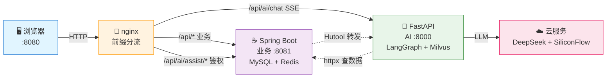
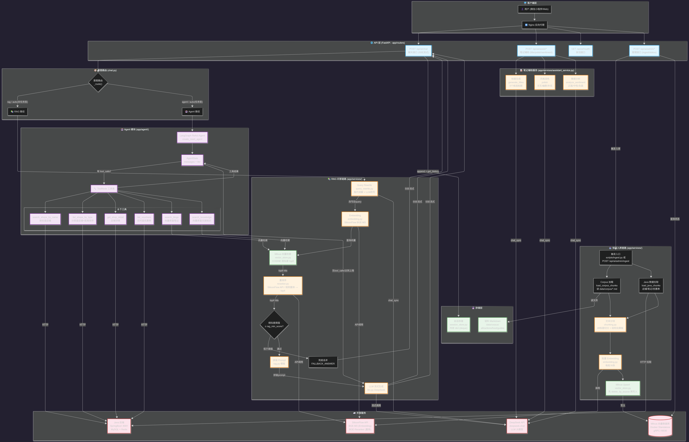

<h1 align="center">🏮 长安文旅探店助手</h1>

<p align="center">
  <strong>Java + Python 双栈 AI 探店平台</strong><br>
  以 Spring Boot 点评平台为底座，叠加 DeepSeek 大模型 + LangGraph Agent + Milvus 向量检索<br>
  打造长安（西安）文旅场景下的智能问答、探店笔记 AI 辅助与智能推荐 Agent
</p>

<p align="center">
  
  
  
  
  
  
  
  
</p>

---

## 📖 目录

- [💡 一句话介绍](#-一句话介绍)
- [✨ 核心亮点](#-核心亮点)
- [🎬 演示剧本与截图](#-演示剧本与截图)
- [🏗 系统架构](#-系统架构)
- [🛠 技术栈总览](#-技术栈总览)
- [📂 项目结构](#-项目结构)
- [🚀 快速开始](#-快速开始)
- [📡 接口设计](#-接口设计)
- [🧠 核心功能深度解析](#-核心功能深度解析)
  - [RAG 智能问答](#1-rag-智能问答多源知识库)
  - [探店 Agent](#2-探店-agentlanggraph)
  - [笔记 AI 辅助](#3-笔记-ai-辅助)
  - [Java 后端核心能力](#4-java-后端核心能力)
- [🗺 开发路线图](#-开发路线图)
- [📚 面试知识点](#-面试知识点)

---

## 💡 一句话介绍

> 在 Spring Boot 点评平台之上，用 **FastAPI + LangGraph + Milvus** 构建 **RAG 智能问答**与**工具调用 Agent**，通过 **nginx 网关分流**实现 Java/Python 双栈异构集成，**SSE 流式输出**，回答可溯源引用。

---

## ✨ 核心亮点

| 功能 | 简介 | 示例对话 |
|------|------|----------|
| 🔍 **RAG 智能问答** | 西安文旅知识库 + 平台实时数据为语料，流式回答带引用来源，一键跳转详情页 | 「西安三日游怎么安排？」 |
| 🤖 **探店 Agent** | 多轮对话中自主调用 6 个工具，完成复合任务 | 「钟楼附近人均 80 以下的美食店，有没有优惠券？」 |
| ✍️ **笔记 AI 辅助** | 一键生成候选标题、按风格润色正文、情感分析自检 + 评论区舆情监控 | 文艺 / 幽默 / 朴实三种风格随心切换 |
| 🎯 **Hit@5=100%** | bge-m3 向量 + jieba 关键词 + MMR 重排的混合检索，20 组标注 QA 实测 MRR=0.967 | — |

---

## 🎬 演示剧本与截图

| 场景 | 对话示例 | 涉及技术 |
|------|----------|----------|
| 🗺 RAG 知识问答 | 「西安三日游怎么安排？」 | 向量检索 → 重排 → 流式生成 → 引用来源 |
| 🍜 Agent 探店 | 「回民街有什么好吃的店？」 | 意图路由 → 查店名 → 查优惠券 |
| 🧭 多轮距离排序 | 「人均 50 以下再近一点」 | 多轮改写 → 查分类 + 坐标距离排序 |
| ✍️ AI 辅助发笔记 | 生成标题（5选1）→ 润色 → 情感自检 | 标题生成 / 风格润色 / 情感分析 |
| 📊 管理后台 | `GET /api/ai/admin/status` | 向量库规模与来源分布 |

<table>
<tr>
<td width="33%" align="center">
  <strong>🏠 应用首页</strong><br><br>
  
</td>
<td width="33%" align="center">
  <strong>📝 AI 候选标题（5选1）</strong><br><br>
  
</td>
<td width="33%" align="center">
  <strong>🗺 AI 智能问答（RAG 流式回答带引用来源）</strong><br><br>
  
</td>
</tr>
<tr>
<td width="33%" align="center">
  <strong>✨ AI 风格润色</strong><br><br>
  
</td>
<td width="33%" align="center">
  <strong>🎭 情感自检</strong><br><br>
  
</td>
<td width="33%" align="center">
  <strong>🤖 Agent 多轮对话（工具调用 + 距离排序）</strong><br><br>
  
</td>
</tr>
</table>

---

## 🏗 系统架构

### 👁 架构概览

> **3 秒看懂**：nginx 网关分流 → Java 管业务 / Python 管 AI → DeepSeek + Milvus 智能增强



> 📐 **高清可编辑架构图**：[photos/architecture.drawio](photos/architecture.drawio)（VS Code 安装 Draw.io Integration 插件即可直接编辑）

### 🔄 数据流全景图（核心请求怎么走）



### 🛣 Nginx 路由规则（流量怎么分）

| 路径前缀 | 目标 | 说明 |
|----------|------|------|
| `/` | nginx 静态资源 | 前端 HTML/CSS/JS 直接托管 |
| `/api/*` | Java :8081 | 店铺/笔记/用户/优惠券等业务 API |
| `/api/ai/chat` | Python :8000 | **SSE 流式直连**（绕过 Java，避免缓冲阻塞） |
| `/api/ai/health` | Python :8000 | 健康检查 |
| `/api/ai/admin/**` | Python :8000 | 管理接口（仅限本机，双保险鉴权） |
| `/api/ai/assist/*` | Java :8081 → Python :8000 | **Java 转发**（需登录鉴权 + 非流式） |

### 💡 三大核心架构决策（为什么这么设计？）

| # | 决策 | 为什么 | 技术细节 |
|---|------|--------|----------|
| 1 | **流式走 nginx 直连，非流式走 Java 转发** | RestTemplate 基于 HttpURLConnection 会整体缓冲，SSE 会被吞成「等 20 秒一次性吐全文」 | nginx `proxy_buffering off` 逐帧透传；前缀最长匹配天然分流，同源 8080 无 CORS |
| 2 | **Python 不直连 MySQL** | 规避内网连通性风险，Python 定位为「Java 之上的智能层」 | 所有数据经 Java REST API 获取，httpx 异步调用 |
| 3 | **统一返回体 `{success, errorMsg, data, total}`** | 前端拦截器只认 `success` 字段，一条链路三种语言格式统一 | Python 模仿 Java `Result` 信封，Java 转发零改造透传 |

---

## 🛠 技术栈总览

### 整体一览

| 层级 | 技术 | 版本 | 用途 |
|------|------|------|------|
| **网关** | nginx | 1.18 | 前缀分流 + 静态资源 + SSE 流式透传 |
| **Java 业务** | Spring Boot | 2.7.18 | 店铺/笔记/用户/优惠券/秒杀 REST API |
| | MyBatis Plus | 3.x | ORM + 分页 |
| | Redis | 7.x | 缓存 / Token / 分布式锁 / Stream / GEO |
| | Redisson | 3.22.0 | 分布式锁 / 布隆过滤器 |
| | MySQL | 8.0 | 业务数据持久化 |
| **Python AI** | FastAPI | 0.115 | AI 服务（ASGI 原生流式） |
| | LangGraph | — | Agent 状态图编排 |
| | Milvus | 3.0 | 向量检索（Docker 部署） |
| **云服务** | DeepSeek | V4 Flash | 对话生成 / Function Calling |
| | SiliconFlow | — | bge-m3 Embedding（1024 维） |

### Java ↔ Python 协作关系

```
┌─────────────────────────────────────────────────┐
│                   Java 8081                      │
│  店铺 / 笔记 / 用户 / 优惠券 / 秒杀 / 签到         │
│  缓存三防 / 分布式锁 / GEO 排序 / Stream 消息队列  │
└──────────────┬──────────────────────────────────┘
               │ REST API（httpx 异步调用）
               ▼
┌─────────────────────────────────────────────────┐
│                  Python 8000                     │
│  RAG 问答 / Agent 工具调用 / 笔记 AI 辅助         │
│  向量检索 / 多轮改写 / 重排 / 流式生成            │
└──────────────┬──────────────────────────────────┘
               │
    ┌──────────┼──────────┐
    ▼          ▼          ▼
  DeepSeek  SiliconFlow  Milvus
```

---

## 📂 项目结构

```
chang_an_travel/
├── README.md
├── photos/                           # 演示截图
│
├── chang_an_ai/                      # Python AI 服务（FastAPI, port 8000）
│   ├── run.py                        #   启动入口
│   ├── requirements.txt              #   Python 依赖
│   ├── .env / .env.example           #   API Key 配置
│   ├── app/
│   │   ├── main.py                   #   FastAPI 入口 + lifespan 懒加载
│   │   ├── config.py                 #   pydantic-settings 配置管理
│   │   ├── routers/                  #   路由层
│   │   │   ├── chat.py               #     SSE 流式聊天（rag/agent/auto）
│   │   │   ├── assistant.py          #     笔记 AI 辅助（标题/润色/情感）
│   │   │   ├── admin.py              #     知识库管理（仅 127.0.0.1）
│   │   │   └── health.py             #     健康检查
│   │   ├── services/                 #   业务逻辑层
│   │   │   ├── rag_service.py        #     RAG 检索+生成编排
│   │   │   ├── agent_service.py      #     LangGraph Agent 编排
│   │   │   ├── assistant_service.py  #     笔记 AI 辅助
│   │   │   ├── ingest_service.py     #     知识库入库
│   │   │   ├── llm.py                #     DeepSeek 对话/生成接口
│   │   │   ├── embedding.py          #     bge-m3 向量化
│   │   │   ├── chunking.py           #     文档分块策略
│   │   │   ├── query_rewrite.py      #     多轮查询改写
│   │   │   ├── reranker.py           #     重排序（jieba+MMR）
│   │   │   └── session_store.py      #     会话管理
│   │   ├── repositories/             #   数据访问层
│   │   │   ├── vector_store.py       #     Milvus 向量库封装
│   │   │   └── java_client.py        #     httpx 调用 Java API
│   │   ├── agent/                    #   Agent 模块
│   │   │   ├── state.py              #     LangGraph 状态定义
│   │   │   ├── graph.py              #     状态图（agent ⇄ tools）
│   │   │   └── tools.py              #     6 个工具函数
│   │   ├── prompts/                  #   提示词模板
│   │   │   ├── rag.py / rewrite.py / agent.py / assistant.py
│   │   └── data/                     #   数据资源
│   │       ├── corpus/               #     西安文旅语料（景点/美食/攻略）
│   │       └── sql/                  #     西安种子数据 SQL
│   ├── scripts/                      #   工具脚本
│   │   ├── ingest.py                 #     知识库建库
│   │   ├── eval_retrieval.py         #     检索效果评估
│   │   └── demo_check.sh             #     一键探活
│   └── tests/                        #   pytest（fake LLM/embedding + respx mock）
│
└── chang_an_backend/                 # Java 后端 + nginx 网关
    ├── chang_an_dianping/            #   Spring Boot 2.7.18（port 8081）
    │   ├── pom.xml
    │   ├── docker-compose.yml        #     RocketMQ 一键部署（预留）
    │   └── src/main/java/com/hmdp/
    │       ├── controller/           #     店铺/笔记/用户/优惠券/AI 转发
    │       ├── service/              #     缓存穿透/击穿/秒杀/签到/分布式锁
    │       ├── config/               #     MVC/MyBatis/Redisson 配置
    │       ├── utils/                #     CacheClient/RedisIDWorker/拦截器
    │       ├── consumer/             #     SeckillOrderConsumer（RocketMQ 预留）
    │       ├── dto/entity/mapper/    #     分层架构
    │       └── HmDianPingApplication.java
    └── nginx-1.18.0/                 #   nginx + 前端静态页（port 8080）
```

---

## 🚀 快速开始

### 环境要求

| 组件 | 版本 | 用途 |
|------|------|------|
| Java | 17+ | Spring Boot 后端 |
| Python | 3.11 | AI 服务 |
| MySQL | 8.0 | 业务数据 |
| Redis | 7.x | 缓存 / Token / 分布式锁 |
| Docker | 20+ | Milvus 向量数据库 |
| nginx | 1.18 | 网关 + 静态资源 |

### 1️⃣ 启动基础设施

```bash
# MySQL + Redis 就绪后启动 Java 后端（8081）

# 启动 Milvus 向量数据库
docker start milvus-standalone
# 首次部署：
# docker run -d --name milvus-standalone -p 19530:19530 -p 9091:9091 milvusdb/milvus:v3.0.0

# 验证 Milvus 就绪
curl http://127.0.0.1:9091/healthz   # 返回 OK
```

### 2️⃣ 启动 Python AI 服务

```bash
cd chang_an_ai

# 创建虚拟环境
conda create -p .venv python=3.11 -y
conda activate .venv

# 安装依赖
pip install -r requirements.txt

# 配置 API Key
cp .env.example .env
# 编辑 .env 填入 DEEPSEEK_API_KEY 和 SILICONFLOW_API_KEY

# 构建知识库
python scripts/ingest.py

# 启动服务（8000 端口）
python run.py
```

### 3️⃣ 启动 nginx 网关

```bash
cd chang_an_backend/nginx-1.18.0
start nginx.exe
# 或双击 nginx.exe
```

### 4️⃣ 打开浏览器

```
http://localhost:8080 → 点击底部「AI 助手」tab 开始体验
```

---

## 📡 接口设计

### Python AI 服务（FastAPI, Port 8000）

| 方法 | 路径 | 说明 | 流式 |
|------|------|------|:----:|
| `GET` | `/api/ai/health` | 健康检查，返回 `{status, kb_count, models}` | |
| `POST` | `/api/ai/chat` | 聊天统一入口，`mode: rag\|agent\|auto` 意图路由 | SSE |
| `POST` | `/api/ai/assist/title` | 生成 5 个候选标题 | |
| `POST` | `/api/ai/assist/polish` | 按风格润色（文艺/幽默/朴实） | |
| `POST` | `/api/ai/assist/sentiment` | 情感分析（发帖自检 / 评论区舆情） | |
| `POST` | `/api/ai/admin/ingest` | 重建知识库（仅 127.0.0.1） | |
| `GET` | `/api/ai/admin/status` | 向量库状态（仅 127.0.0.1） | |

### 鉴权设计

```
前端 token（sessionStorage）
    │
    ├─ /api/ai/assist/* → Java 转发 → 需登录（/ai/** 不在白名单）
    │   语义：发笔记需登录 → AI 辅助也需登录
    │
    └─ /api/ai/chat → nginx 直连 Python → 对内不设防
        靠网络边界：nginx 只暴露 chat/health，admin 仅 127.0.0.1
```

---

## 🧠 核心功能深度解析

### 1. RAG 智能问答（多源知识库）

```
入库链路
  corpus 语料（md 按二级标题 400-600 字 + overlap 80）
  + 店铺/笔记/券（一条记录一个 chunk）
  → bge-m3 embedding（1024 维）
  → Milvus collection: changan_kb（COSINE 度量，AUTOINDEX）

查询链路
  用户问题 → 多轮 query 改写（LLM + 启发式短路）
  → embedding → 召回 Top8
  → 重排 Top4（jieba 关键词 + 类型商圈匹配 + 质量分 + MMR）
  → 拼 prompt → DeepSeek 流式生成 → SSE 推送给前端

防幻觉三板斧
  ① prompt 强制「知识库没有就明说」
  ② score < 0.35 阈值兜底，不进 LLM
  ③ 句末 [1][2] 引用标注，前端渲染「参考来源」卡片可点击跳转
```

### 2. 探店 Agent（LangGraph）

```
状态图:  START → agent(LLM+tools) → 条件边 → tools(ToolNode) ⇄ agent → END
         max_iter=6 防死循环，astream_events v2 流式

6 个工具:
  ┌──────────────┬────────────────────────────────┐
  │ 工具          │ 数据来源                        │
  ├──────────────┼────────────────────────────────┤
  │ 查店名        │ Java API 实时查询               │
  │ 查分类(带坐标) │ Java API + Redis GEO 距离排序   │
  │ 查详情        │ Java API 实时查询               │
  │ 查优惠券      │ Java API 实时（库存实时变化）    │
  │ 查笔记        │ 本地向量库（source=blog 过滤）   │
  │ 查知识        │ 本地向量库（source=corpus 过滤） │
  └──────────────┴────────────────────────────────┘

工具失败兜底: 捕获异常 → 返回结构化错误文本给 LLM → 换策略重试
```

### 3. 笔记 AI 辅助

| 功能 | 输入 | 输出 | 风格选项 |
|------|------|------|----------|
| 标题生成 | 笔记正文 + 店铺名 | 5 个候选标题（前端点选回填） | — |
| 风格润色 | 原始文本 | 润色后文本 | 文艺 / 幽默 / 朴实 |
| 情感分析 | 单条文本 / 评论列表 | `{sentiment, score, keywords, summary}` | — |

### 4. Java 后端核心能力

> Spring Boot 2.7.18 + MyBatis Plus + Redis + Redisson，提供店铺/笔记/用户/优惠券/秒杀等完整业务链路，同时作为 AI 层的数据底座。

#### 4.1 缓存三大问题综合防护

```
请求 → 布隆过滤器（第一道防线）→ Redis 缓存命中？
         ├─ 拦截：ID 不存在 → 直接返回 null（防穿透）
         └─ 放行 → 缓存存在？
                    ├─ 不存在 → 查库 → 空值缓存（防穿透）+ 逻辑过期缓存 → 返回
                    └─ 存在 → 逻辑过期？
                               ├─ 未过期 → 直接返回
                               └─ 已过期 → 抢互斥锁 → 异步重建缓存 → 返回旧数据（防击穿）
```

| 问题 | 解决方案 | 技术细节 |
|------|----------|----------|
| **缓存穿透** | 布隆过滤器 + 空值缓存 | Redisson `RBloomFilter` 拦截不存在 ID；数据库也不存在时写 `""` 短 TTL 缓存 |
| **缓存击穿** | 逻辑过期 + 互斥锁 + 双重检查 | 热点数据设逻辑过期时间；过期后抢分布式锁，异步重建，返回旧数据保证可用性 |
| **缓存雪崩** | TTL 随机化 | `random.nextLong(time-10, time+10)` 避免缓存同时过期 |

> 核心代码：[CacheClient.queryWithAllProtection](file:///d:/zmz/project/chang_an_travel/chang_an_backend/chang_an_dianping/src/main/java/com/hmdp/utils/CacheClient.java#L56-L133)

#### 4.2 秒杀系统（Redis Stream + RocketMQ 预留）

```
用户请求 → Lua 脚本原子扣库存（防超卖）→ 生成订单 ID → 发消息队列 → 异步消费建单
```

| 方案 | 当前状态 | 说明 |
|------|----------|------|
| **Redis Stream** | 生产环境 | 零额外部署，利用已有 Redis，`stream.orders` 消费组异步建单 |
| **RocketMQ** | 注释预留 | 完整实现已就绪（消费者 + 本地消息表补偿 + Docker 部署），高并发时可解除注释切换 |

#### 4.3 分布式锁与全局 ID

| 功能 | 实现 | 场景 |
|------|------|------|
| **Redisson 分布式锁** | `RLock.tryLock()` | 秒杀下单防并发冲突、缓存重建互斥 |
| **全局唯一 ID** | Snowflake 算法（`RedisIDWorker`） | 订单 ID 生成，避免数据库自增瓶颈 |
| **布隆过滤器** | Redisson `RBloomFilter` | 商铺 ID 预加载，拦截非法查询 |

#### 4.4 用户认证与会话管理

```
登录 → 生成 Token（UUID）→ 存 Redis（Hash: user:token:{token} → userId）
       → 返回 Token 给前端
       
请求 → RefreshTokenInterceptor（刷新 TTL）→ LoginInterceptor（校验登录）→ Controller
```

- **双拦截器设计**：`RefreshTokenInterceptor`（order=0）每次请求刷新 Token TTL；`LoginInterceptor`（order=1）校验登录态
- **ThreadLocal 传递**：`UserHolder` 基于 `ThreadLocal<UserDTO>` 在拦截器与业务层之间传递用户信息

#### 4.5 核心业务模块

| 模块 | 功能 | 技术亮点 |
|------|------|----------|
| **店铺查询** | 按 ID / 类型 / 坐标距离查询 | Redis GEO 距离排序 + 分页 |
| **探店笔记** | 发布 / 点赞 / 关注推送 / 评论 | Redis BitMap 点赞、ZSet 关注推送 |
| **优惠券** | 普通券 / 秒杀券 | Lua 脚本原子扣库存 |
| **签到** | 连续签到统计 | Redis BitMap 按位存储 |
| **附近店铺** | 基于 GEO 的半径搜索 | `GEOSEARCH` + `ORDER BY FIELD` 保持距离顺序 |

#### 4.6 与 AI 层的集成

```
Python AI 服务 ← httpx 异步调用 ← Java REST API
    │
    ├─ 拉店铺/笔记/优惠券数据 → 构建 Milvus 知识库
    ├─ Agent 工具实时查询 → Java API 获取最新数据
    └─ 笔记 AI 辅助 → Java AiController 转发鉴权请求
```

- **Python 不直连 MySQL**：规避内网连通性风险，所有数据经 Java REST API 获取
- **统一返回体**：`{success, errorMsg, data, total}` 前后端格式统一
- **SSE 流式分流**：nginx 前缀最长匹配，`/api/ai/chat` 直连 Python 8000，其余走 Java 8081

---