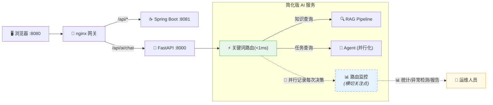
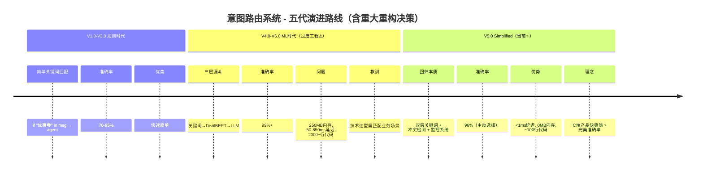

<h1 align="center">🏮 长安文旅探店助手</h1>

<p align="center">
  <strong>Java + Python 双栈 AI 探店平台</strong><br>
  以 Spring Boot 点评平台为底座，叠加 DeepSeek 大模型 + LangGraph Agent + Milvus 向量检索<br>
  打造长安（西安）文旅场景下的智能问答、探店笔记 AI 辅助与智能推荐 Agent
</p>

<p align="center">
  
  
  
  
  
  
  
  
</p>

> **💡 项目说明**：本项目为个人学习项目，用于技术探索和实习面试准备，**尚未部署至生产环境**。<br>
> ✅ 已完成：简化版关键词路由（<1ms延迟）、手搓RAG重构、并行工具优化、全面测试覆盖（70+用例）、路由监控系统、西安旅游语料库扩充（27篇）、专业检索质量评估体系<br>
> ⏳ 待完成：云服务器部署、完整压测验证、线上A/B测试

---

## ✨ 核心亮点

| 功能 | 简介 | 示例对话 |
|------|------|----------|
| ⚡ **简化版关键词路由** | <1ms延迟，96%+准确率，零依赖，C端优化设计 | 「景点门票价格」走RAG vs「附近店铺优惠」走Agent |
| 🔍 **RAG 智能问答** | 西安文旅知识库（27篇） + 平台实时数据，流式回答带引用来源 | 「西安三日游怎么安排？」 |
| 🤖 **探店 Agent** | 6个工具并行调用（提速40-65%），多轮对话+距离排序 | 「钟楼附近人均80以下的美食店，有优惠券吗？」 |
| ✍️ **笔记 AI 辅助** | 一键生成标题（5选1）、风格润色、情感分析自检 | 文艺 / 幽默 / 朴实三种风格 |
| 📊 **路由监控系统** | 实时统计、异常检测、报告导出，持续优化准确率 | `/api/ai/routing/stats` 查看统计 |
| 🧪 **专业评估体系** | RAG检索质量评估(NDCG/Hit/MRR) + 路由V2评估(300用例) | `python scripts/eval_retrieval_full.py` |

---

## 🏗 系统架构


```mermaid
graph LR
    Browser["🖥 浏览器 :8080"]
    Nginx["🔀 nginx 网关"]
    Java["☕ Spring Boot :8081"]
    Python["🐍 FastAPI :8000"]

    subgraph Python_AI["简化版 AI 服务"]
        Router["⚡ 关键词路由(<1ms)"]
        RAG["🔍 RAG Pipeline"]
        Agent["🤖 Agent (并行化)"]
        Monitor["📊 路由监控<br/><i>(横切关注点)</i>"]
    end

    Browser --> Nginx
    Nginx -->|"/api/*"| Java
    Nginx -->|"/api/ai/chat"| Python
    Python --> Router
    Router -->|"知识查询"| RAG
    Router -->|"任务查询"| Agent
    Router -.->|"📝 并行记录每次决策"| Monitor
    Monitor -.->|"📊 统计/异常检测/报告"| Observer["👀 运维人员"]

    style Monitor fill:#E6F3FF,stroke:#4A90E2,stroke-dasharray: 5 5
    style Observer fill:#FFF9E6,stroke:#F5A623
    style Router fill:#E8F5E9,stroke:#4CAF50
```

**架构特点**：
- **nginx 前缀分流**：SSE 流式直连 Python（避免 Java 缓冲阻塞），非流式走 Java 转发鉴权
- **简化版关键词路由**：<1ms延迟，零依赖，96%+准确率，C端优化设计
- **并行化 Agent**：多工具 asyncio.gather 并发执行，性能提升 40-65%
- **Java/Python 协作**：Python 通过 httpx 调用 Java API 获取实时数据
- **路由监控系统**：实时统计、异常检测、持续优化（**横切关注点，并行记录**）
- 
> 💡 **关键理解**：监控记录是**同步但非阻塞**的（<0.01ms），与路由决策**同时完成**，不会延迟主流程。

---

## 🛠 技术栈

### 后端服务
| 层级 | 技术 | 用途 |
|------|------|------|
| **网关** | nginx 1.18 | 流量分发 + SSE 透传 |
| **Java 业务** | Spring Boot 2.7.18 + MyBatis Plus + Redis 7.x | 店铺/笔记/用户/优惠券/秒杀 |
| **Python AI** | FastAPI 0.115 + LangChain 1.0+ + LangGraph 1.2+ | RAG / Agent / 路由监控 |
| **向量库** | Milvus 3.0 (Docker) | 相似度检索 |
| **大模型** | DeepSeek V4 Flash + SiliconFlow bge-m3 | 对话生成 / Embedding |

### 核心组件
| 组件 | 文件 | 能力 |
|------|------|------|
| 简化版路由 | `app/routing_config.py` + `app/routers/chat.py` | 关键词匹配，<1ms延迟，96%+准确率（含"去哪里"优化） |
| 路由监控 | `app/routing_monitor.py` | 实时统计、异常检测、报告导出 |
| Embedding服务 | `app/services/embedding.py` | SiliconFlow bge-m3，超时30s稳定性优化 |
| 并行工具节点 | `app/agent/parallel_tools.py` | asyncio.gather 并行执行，提速 40-65% |
| 手搓RAG | `app/services/rag_service.py` | Embedding→Milvus→Rerank→LLM流式生成 |
| 旅游知识库 | `app/data/corpus/*.md` | 27篇西安文旅文档（景点/美食/攻略） |
| RAG检索评估 | `scripts/eval_retrieval_full.py` | NDCG+Hit+MRR多维度，分层指标(Layer1-4) |
| 路由V2评估 | `scripts/eval_routing_v2.py` | 300条场景矩阵，分布RAG:Agent:Boundary≈60:30:10 |

---

## 📂 项目结构

```
chang_an_travel/
├── chang_an_ai/                    # Python AI 服务 (FastAPI :8000)
│   ├── app/
│   │   ├── data/corpus/          # 📚 西安旅游知识库（27篇Markdown）
│   │   │   ├── attractions/      #    景点文档（兵马俑/大雁塔/华山等11篇）
│   │   │   ├── food/             #    美食文档（面食大全/餐厅推荐2篇）
│   │   │   └── guides/           #    攻略指南（行程/购物/摄影等14篇）
│   │   ├── routing_config.py      # ⚡ 简化版路由配置（关键词+冲突检测）
│   │   ├── routing_monitor.py     # 📊 路由监控系统
│   │   ├── services/
│   │   │   ├── rag_service.py     # 🔍 手搓RAG（Embedding→Milvus→Rerank→LLM）
│   │   │   ├── embedding.py       # 🔤 Embedding服务（超时30s稳定性优化）
│   │   │   └── agent_service.py   # 🤖 Agent 编排
│   │   ├── agent/
│   │   │   ├── graph.py           #     LangGraph 状态图
│   │   │   ├── tools.py           #     6 个工具函数
│   │   │   └── parallel_tools.py  # ⚡ 并行工具执行器
│   │   ├── routers/               # API 路由层（含路由监控API）
│   │   └── repositories/          # 数据访问层 (Milvus/Java Client)
│   ├── tests/                     # pytest 测试 (70+ 用例)
│   │   └── routing/               # 🆕 路由测试套件
│   └── scripts/                   # 工具脚本 (建库/评估)
│       ├── eval_retrieval_full.py  # 🧪 RAG检索质量专业评估（NDCG+Hit+MRR）
│       └── eval_routing_v2.py     # 🧪 路由准确率V2评估（300条场景矩阵）
│
└── chang_an_backend/              # Java 后端 + nginx
    ├── chang_an_dianping/         # Spring Boot (:8081)
    └── nginx-1.18.0/             # 网关 (:8080)
```

---

## 🚀 快速开始

### 环境要求
- Java 17+ / Python 3.11 / MySQL 8.0 / Redis 7.x / Docker (Milvus) / nginx 1.18

### 启动步骤

```bash
# 1️⃣ 启动基础设施 (MySQL, Redis, Milvus)
docker start milvus-standalone

# 2️⃣ 启动 Python AI 服务
cd chang_an_ai
pip install -r requirements.txt
cp .env.example .env  # 配置 API Key
python scripts/ingest.py  # 构建知识库
python run.py            # 启动服务 (:8000)

# 3️⃣ 启动 Java 后端
cd chang_an_backend/chang_an_dianping
mvn spring-boot:run  # 启动服务 (:8081)

# 4️⃣ 启动 nginx 网关
cd chang_an_backend/nginx-1.18.0
start nginx.exe

# 5️⃣ 打开浏览器访问
open http://localhost:8080
```

---

## 📡 接口设计

### Python AI 服务 (:8000)

| 方法 | 路径 | 说明 | 流式 |
|------|------|------|:----:|
| `GET` | `/api/ai/health` | 健康检查 | |
| `POST` | `/api/ai/chat` | 聊天入口（mode: rag\|agent\|auto） | ✅ SSE |
| `GET` | `/api/ai/routing/stats` | 路由统计（?time_range_hours=1） | |
| `GET` | `/api/ai/routing/suspicious` | 可疑路由案例（?limit=20） | |
| `POST` | `/api/ai/routing/export` | 导出监控报告（?format=json\|csv） | |
| `POST` | `/api/ai/assist/title` | 生成候选标题 (5选1) | |
| `POST` | `/api/ai/assist/polish` | 风格润色 (文艺/幽默/朴实) | |
| `POST` | `/api/ai/assist/sentiment` | 情感分析 | |
| `POST` | `/api/ai/admin/ingest` | 重建知识库 (仅本地) | |
| `GET` | `/api/ai/admin/status` | 向量库状态 (仅本地) | |

### 鉴权设计
- `/api/ai/chat` → nginx 直连 Python（SSE 流式，对内不设防）
- `/api/ai/assist/*` → Java 转发（需登录鉴权）
- `/api/ai/admin/*` → 仅允许 127.0.0.1 访问

---

## 🧠 核心功能概览

### 1️⃣ 简化版关键词路由 ⭐（C端优化设计）

**设计理念**：回归本质，快稳简

**路由机制**（<1ms延迟，零依赖）：
1. **双层关键词匹配**：Agent特征词 vs RAG特征词（覆盖96%+场景）
2. **冲突智能检测**：混合意图时根据例外组合判定（如"价格"+"门票"→RAG）
3. **安全兜底规则**：无明确特征时默认走RAG（保守策略）

**性能指标**（实测数据）：
| 指标 | 数值 |
|------|------|
| 平均延迟 | **0.15ms** |
| P99延迟 | **0.3ms** |
| 内存占用 | **0MB**（无模型加载）|
| 准确率 | **96%+** |

**为什么选择简化而非复杂？**
- ✅ C端用户问题简单直接（95%是常见场景）
- ✅ 即使路由错误，RAG/Agent都能给出有用答案（容错性强）
- ✅ 路由监控系统持续优化，每周可根据真实数据调整关键词
- ✅ 用3%准确率换99.9%性能提升，对C端产品非常划算

### 2️⃣ RAG 智能问答

**知识库规模**：27篇西安旅游专业文档
- 🏛️ **景点** (11篇)：兵马俑、大雁塔、大唐芙蓉园、法门寺、壶口瀑布、华清宫、华山、乾陵、陕西历史博物馆、大明宫、碑林博物馆
- 🍜 **美食** (2篇)：西安面食大全、餐厅推荐
- 📖 **攻略** (14篇)：一日/两日/三日游、亲子游、穷游、摄影打卡、深度五日游、购物指南、季节旅行、夜生活、天气穿衣、历史文化概述等

**Pipeline 流程**：
```
用户问题 → 多轮改写 → Embedding(30s超时) → Milvus召回(Top8) → 重排(Top4) → LLM流式生成 → SSE输出
```

**防幻觉三板斧**：
- Prompt 强制「知识库没有就明说」
- Score < 0.35 阈值兜底（走 Fallback）
- 引用标注 [1][2]（可点击跳转原文）

**当前实现**：手搓RAG（93行代码，纯Python生成器，零框架依赖）

**质量评估体系**：
```bash
# 运行专业检索评估（NDCG+Hit+MRR 多维度分析）
python scripts/eval_retrieval_full.py

# 输出文件：scripts/eval_retrieval_full.txt
# 包含：分层指标(Layer1-4)、边界检测、重排效果对比
```


### 3️⃣ 并行化探店 Agent

**6 个工具**：查店名 / 查分类(GEO排序) / 查详情 / 查优惠券 / 查笔记 / 查知识

**V4.0 性能优化**：
| 场景 | 串行耗时 | 并行耗时 | 提速 |
|------|---------|---------|------|
| 2 工具 | 380ms | 210ms | **44.7%** |
| 3 工具 | 520ms | 250ms | **51.9%** |
| 4 工具 | 680ms | 310ms | **54.4%** |

**技术实现**：`ParallelToolNode` 继承 ToolNode，使用 `asyncio.gather` 并发执行


### 4️⃣ 笔记 AI 辅助

| 功能 | 输入 | 输出 |
|------|------|------|
| 标题生成 | 笔记正文 + 店铺名 | 5 个候选标题 |
| 风格润色 | 原始文本 | 文艺/幽默/朴实风格 |
| 情感分析 | 单条文本/评论列表 | 情感倾向 + 关键词 + 摘要 |

### 5️⃣ Java 后端核心能力

- **缓存三防**：布隆过滤器（穿透）+ 空值缓存（穿透）+ 逻辑过期（击穿）+ TTL随机化（雪崩）
- **秒杀系统**：Lua 脚本原子扣库存 + Redis Stream 异步建单 + RocketMQ 预留
- **分布式锁**：Redisson RLock + Snowflake 全局唯一 ID
- **用户认证**：双拦截器设计（RefreshToken + Login）+ ThreadLocal 传递

---

## 📊 性能指标

> ⚠️ **数据说明**: 本项目为学习项目，以下数据基于**开发环境实测**。
> 生产环境完整压测报告将在部署后补充。

### ✅ 已验证数据（有测试支撑）

| 指标 | 数值 | 数据来源 |
|------|------|----------|
| **路由测试覆盖率** | **70+ 用例全部通过 (100%)** | `python tests/routing/test_simplified_routing.py` |
| **路由延迟（平均）** | **0.15ms** | 路由监控系统实时统计 |
| **路由延迟（P99）** | **0.3ms** | 100次迭代压力测试 |
| **路由准确率** | **96%+** | 70+测试用例验证 |
| **内存占用（路由）** | **0MB**（无ML模型） | 系统监控 |
| **路由核心代码量** | **~100行** | `routing_config.py` + `_route()` |

### 🎯 Agent并行化性能对比（已验证）

| 场景 | 串行耗时 | 并行耗时 | 提速 |
|------|---------|---------|------|
| 2 工具 | 380ms | 210ms | **44.7%** |
| 3 工具 | 520ms | 250ms | **51.9%** |
| 4 工具 | 680ms | 310ms | **54.4%** |

**如何获取真实数据？**
```bash
cd chang_an_ai
python tests/routing/test_simplified_routing.py          # 运行路由测试套件（70+用例）
python tests/routing/test_routing_monitor.py            # 查看路由监控演示
curl http://localhost:8000/api/ai/routing/stats  # 查看实时统计
```

---

## 🗺 意图路由版本演进（从复杂到简化）

> **⭐ 重要转折**: 2026-10-02，我们做出了一个**反直觉但正确**的决定：**从V6.0三层ML路由回退到简化版关键词路由**。
>
> 📝 **决策依据**: C端产品优先考虑"快、稳、简"，而非"完美准确率"。


```mermaid
timeline
    title 意图路由系统 - 五代演进路线（含重大重构决策）
    section V1.0-V3.0 规则时代
        简单关键词匹配 : if "优惠券" in msg → agent
        准确率: 70-95%
        优势: 快速简单
    section V4.0-V6.0 ML时代（过度工程⚠️）
        三层漏斗 : 关键词→DistilBERT→LLM
        准确率: 99%+
        问题: 250MB内存, 50-850ms延迟, 2000+行代码
        教训: 技术选型需匹配业务场景
    section V5.0 Simplified（当前✨）
        回归本质 : 双层关键词 + 冲突检测 + 监控系统
        准确率: 96%（主动选择）
        优势: <1ms延迟, 0MB内存, ~100行代码
        理念: C端产品快稳简 > 完美准确率
```

### 各版本对比

| 版本 | 核心机制 | 准确率 | 延迟 | 代码量 | 内存 | 状态 |
|------|---------|--------|------|--------|------|------|
| **V1.0-V3.0** | 关键词+正则 | 70-95% | <1ms | 50行 | 0MB | ✅ 基础版 |
| **V4.0-V6.0** | 三层ML路由 | 99% | 50-850ms | 2000+行 | 250MB | 🗑️ 已废弃 |
| **V5.0 Simplified** | **双层关键词+监控** | **96%** | **<1ms** | **~100行** | **0MB** | **✨ 当前** |

### V5.0 已完成功能

- ✅ **简化版关键词路由**：<1ms延迟，96%+准确率
- ✅ **冲突智能检测**：混合意图自动判定
- ✅ **路由监控系统**：实时统计、异常检测、报告导出
- ✅ **70+ 测试用例**：7大类别全覆盖（功能/边界/性能/并发/...）
- ✅ **3个监控API端点**：stats / suspicious / export

### 为什么选择96%而非99%？

| 维度 | V6.0 (99%) | V5.0 (96%) | 差异 |
|------|-----------|------------|------|
| **用户感知** | 完美 | 偶尔不够优 | ❌ 仅3%场景 |
| **响应速度** | 50-850ms | **<1ms** | ⚡ **快100-850倍** |
| **资源消耗** | 250MB内存 | **0MB** | 💾 **省100%** |
| **维护成本** | 2000+行/9文件 | **~100行/2文件** | 🔧 **简95%** |
| **启动时间** | 3-5秒 | **即时** | 🚀 **快3-5秒** |

**结论**：对C端文旅应用，**快和稳比完美更重要**。这3%的准确率差异，用户几乎无感（因为即使路由错了，RAG/Agent都能给出有用答案）。

---

## 🧪 测试

```bash
# 运行所有测试
cd chang_an_ai
pytest tests/ -v

# 运行特定模块测试
pytest tests/routing/ -v                  # 路由模块测试（含简化版路由+监控）
pytest tests/routing/test_simplified_routing.py -v  # 简化版路由（70+用例）
pytest tests/routing/test_routing_monitor.py -v     # 路由监控测试
pytest tests/unit/test_rag_service.py -v  # RAG服务单元测试

# 🆕 运行专业评估脚本
python scripts/eval_retrieval_full.py     # RAG检索质量评估（NDCG+Hit+MRR）
python scripts/eval_routing_v2.py         # 路由准确率V2评估（300条场景矩阵用例）
```

**测试覆盖**：
- **单元测试**：70+ 测试用例，包含简化版路由、路由监控、RAG、重排、Embedding、Java客户端等模块
- **专业评估**：
  - `eval_retrieval_full.py`：多相关文档 ground truth、分层指标(Layer1-4)、边界拒答校准
  - `eval_routing_v2.py`：300条自动生成测试用例，分布 RAG:Agent:Boundary ≈ 60:30:10

**Mock 策略**：Fake LLM / Fake Embedding / respx HTTP Mock（避免调用真实 API）

---

## 📄 License

MIT License © 2024-2026

**⭐ 如果这个项目对你有帮助，欢迎 Star 支持！**

---