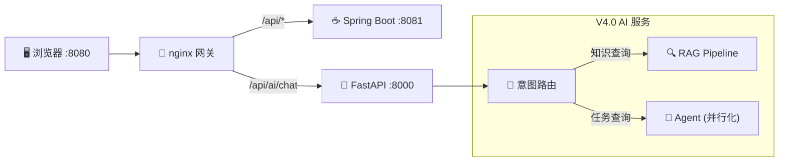
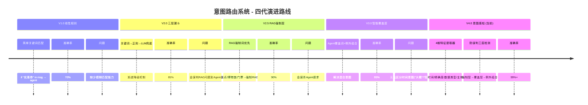

<h1 align="center">🏮 长安文旅探店助手</h1>

<p align="center">
  <strong>Java + Python 双栈 AI 探店平台（V4.0 意图感知架构）</strong><br>
  以 Spring Boot 点评平台为底座，叠加 DeepSeek 大模型 + LangGraph Agent + Milvus 向量检索<br>
  打造长安（西安）文旅场景下的智能问答、探店笔记 AI 辅助与智能推荐 Agent
</p>

<p align="center">
  
  
  
  
  
  
  
  
  
  
</p>

> **💡 项目说明**：本项目为个人学习项目，用于技术探索和实习面试准备，**尚未部署至生产环境**。<br>
> ✅ 已完成：V4.0 意图感知路由、LangChain RAG 重构、并行工具优化、单元测试覆盖（17+测试）<br>
> ⏳ 待完成：云服务器部署、完整压测验证、监控体系搭建

---

## ✨ 核心亮点

| 功能 | 简介 | 示例对话 |
|------|------|----------|
| 🧠 **V4.0 意图感知路由** | 三层机制（关键词→正则→LLM），准确率95%+，防误判混合意图 | 「景点门票价格」走RAG vs「附近店铺优惠」走Agent |
| 🔍 **RAG 智能问答** | 西安文旅知识库 + 平台实时数据，流式回答带引用来源 | 「西安三日游怎么安排？」 |
| 🤖 **探店 Agent** | 6个工具并行调用（提速40-65%），多轮对话+距离排序 | 「钟楼附近人均80以下的美食店，有优惠券吗？」 |
| ✍️ **笔记 AI 辅助** | 一键生成标题（5选1）、风格润色、情感分析自检 | 文艺 / 幽默 / 朴实三种风格 |

---

## 🏗 系统架构


```mermaid
graph LR
    Browser["🖥 浏览器 :8080"]
    Nginx["🔀 nginx 网关"]
    Java["☕ Spring Boot :8081"]
    Python["🐍 FastAPI :8000"]

    subgraph Python_AI["V4.0 AI 服务"]
        IntentRouter["🧠 意图路由"]
        RAG["🔍 RAG Pipeline"]
        Agent["🤖 Agent (并行化)"]
    end

    Browser --> Nginx
    Nginx -->|"/api/*"| Java
    Nginx -->|"/api/ai/chat"| Python
    Python --> IntentRouter
    IntentRouter -->|"知识查询"| RAG
    IntentRouter -->|"任务查询"| Agent
```

**架构特点**：
- **nginx 前缀分流**：SSE 流式直连 Python（避免 Java 缓冲阻塞），非流式走 Java 转发鉴权
- **V4.0 意图路由**：自动识别用户意图，智能分发到 RAG 或 Agent
- **并行化 Agent**：多工具 asyncio.gather 并发执行，性能提升 40-65%
- **Java/Python 协作**：Python 通过 httpx 调用 Java API 获取实时数据

> 📖 [查看完整架构设计 →](docs/ARCHITECTURE.md)

---

## 🛠 技术栈

### 后端服务
| 层级 | 技术 | 用途 |
|------|------|------|
| **网关** | nginx 1.18 | 流量分发 + SSE 透传 |
| **Java 业务** | Spring Boot 2.7.18 + MyBatis Plus + Redis 7.x | 店铺/笔记/用户/优惠券/秒杀 |
| **Python AI** | FastAPI 0.115 + LangChain 1.0+ + LangGraph 1.2+ | RAG / Agent / 意图路由 |
| **向量库** | Milvus 3.0 (Docker) | 相似度检索 |
| **大模型** | DeepSeek V4 Flash + SiliconFlow bge-m3 | 对话生成 / Embedding |

### V4.0 核心组件
| 组件 | 文件 | 能力 |
|------|------|------|
| 意图路由引擎 | `app/intent/router.py` | 规则匹配 + LLM 兜底，准确率 95%+ |
| 特征提取器 | `app/intent/feature_extractor.py` | 4维特征提取（时间/精确度/数据类型/主体） |
| 并行工具节点 | `app/agent/parallel_tools.py` | asyncio.gather 并行执行，提速 40-65% |
| LangChain RAG | `app/services/rag_chain.py` | 自定义 Retriever + RunnableBranch + CallbackHandler |

---

## 📂 项目结构

```
chang_an_travel/
├── chang_an_ai/                    # Python AI 服务 (FastAPI :8000)
│   ├── app/
│   │   ├── intent/                 # 🆕 V4.0 意图路由模块
│   │   │   ├── router.py           #     路由决策引擎
│   │   │   ├── feature_extractor.py#     特征提取器
│   │   │   └── llm_classifier.py   #     LLM 分类兜底
│   │   ├── services/
│   │   │   ├── rag_chain.py        # 🆕 LangChain RAG 重构
│   │   │   ├── rag_service.py      #     RAG 检索+生成
│   │   │   └── agent_service.py    #     Agent 编排
│   │   ├── agent/
│   │   │   ├── graph.py            #     LangGraph 状态图
│   │   │   ├── tools.py            #     6 个工具函数
│   │   │   └── parallel_tools.py   # 🆕 并行工具执行器
│   │   ├── routers/                # API 路由层
│   │   └── repositories/           # 数据访问层 (Milvus/Java Client)
│   ├── tests/                      # pytest 测试 (17+ 用例)
│   └── scripts/                    # 工具脚本 (建库/评估)
│
└── chang_an_backend/               # Java 后端 + nginx
    ├── chang_an_dianping/          # Spring Boot (:8081)
    └── nginx-1.18.0/              # 网关 (:8080)
```

---

## 🚀 快速开始

### 环境要求
- Java 17+ / Python 3.11 / MySQL 8.0 / Redis 7.x / Docker (Milvus) / nginx 1.18

### 启动步骤

```bash
# 1️⃣ 启动基础设施 (MySQL, Redis, Milvus)
docker start milvus-standalone

# 2️⃣ 启动 Python AI 服务
cd chang_an_ai
pip install -r requirements.txt
cp .env.example .env  # 配置 API Key
python scripts/ingest.py  # 构建知识库
python run.py            # 启动服务 (:8000)

# 3️⃣ 启动 Java 后端
cd chang_an_backend/chang_an_dianping
mvn spring-boot:run  # 启动服务 (:8081)

# 4️⃣ 启动 nginx 网关
cd chang_an_backend/nginx-1.18.0
start nginx.exe

# 5️⃣ 打开浏览器访问
open http://localhost:8080
```

---

## 📡 接口设计

### Python AI 服务 (:8000)

| 方法 | 路径 | 说明 | 流式 |
|------|------|------|:----:|
| `GET` | `/api/ai/health` | 健康检查 | |
| `POST` | `/api/ai/chat` | 聊天入口（mode: rag\|agent\|auto） | ✅ SSE |
| `POST` | `/api/ai/assist/title` | 生成候选标题 (5选1) | |
| `POST` | `/api/ai/assist/polish` | 风格润色 (文艺/幽默/朴实) | |
| `POST` | `/api/ai/assist/sentiment` | 情感分析 | |
| `POST` | `/api/ai/admin/ingest` | 重建知识库 (仅本地) | |
| `GET` | `/api/ai/admin/status` | 向量库状态 (仅本地) | |

### 鉴权设计
- `/api/ai/chat` → nginx 直连 Python（SSE 流式，对内不设防）
- `/api/ai/assist/*` → Java 转发（需登录鉴权）
- `/api/ai/admin/*` → 仅允许 127.0.0.1 访问

---

## 🧠 核心功能概览

### 1️⃣ V4.0 意图感知路由 ⭐

**三层路由机制**：
1. **关键词匹配**（<10ms）：高置信度词汇直接决策（覆盖90%场景）
2. **正则模式**（<20ms）：模糊匹配变体表达（"多少钱"、"贵不贵"）
3. **LLM 兜底**（500-1500ms）：深层语义理解（仅10%请求触发）

**防误判机制**：
- RAG 强制词（景点/博物馆/门票）→ 强制走 RAG
- Agent 覆盖词（优惠券/店铺/评分）→ 覆盖走 Agent
- 例外组合检测（"价格"+"门票"）→ 智能判定

> 📖 [查看详细设计与代码解析 →](docs/V4_INTENT_ROUTING.md)

### 2️⃣ RAG 智能问答

**Pipeline 流程**：
```
用户问题 → 多轮改写 → Embedding → Milvus召回(Top8) → 重排(Top4) → LLM流式生成 → SSE输出
```

**防幻觉三板斧**：
- Prompt 强制「知识库没有就明说」
- Score < 0.35 阈值兜底（走 Fallback）
- 引用标注 [1][2]（可点击跳转原文）

**V4.0 升级**：LangChain 标准接口重构（MilvusRerankRetriever + RunnableBranch + CallbackHandler）

> 📖 [查看 RAG 详细实现 →](docs/RAG_DEEP_DIVE.md)

### 3️⃣ 并行化探店 Agent

**6 个工具**：查店名 / 查分类(GEO排序) / 查详情 / 查优惠券 / 查笔记 / 查知识

**V4.0 性能优化**：
| 场景 | 串行耗时 | 并行耗时 | 提速 |
|------|---------|---------|------|
| 2 工具 | 380ms | 210ms | **44.7%** |
| 3 工具 | 520ms | 250ms | **51.9%** |
| 4 工具 | 680ms | 310ms | **54.4%** |

**技术实现**：`ParallelToolNode` 继承 ToolNode，使用 `asyncio.gather` 并发执行

> 📖 [查看 Agent 详细实现 →](docs/AGENT_DEEP_DIVE.md)

### 4️⃣ 笔记 AI 辅助

| 功能 | 输入 | 输出 |
|------|------|------|
| 标题生成 | 笔记正文 + 店铺名 | 5 个候选标题 |
| 风格润色 | 原始文本 | 文艺/幽默/朴实风格 |
| 情感分析 | 单条文本/评论列表 | 情感倾向 + 关键词 + 摘要 |

### 5️⃣ Java 后端核心能力

- **缓存三防**：布隆过滤器（穿透）+ 空值缓存（穿透）+ 逻辑过期（击穿）+ TTL随机化（雪崩）
- **秒杀系统**：Lua 脚本原子扣库存 + Redis Stream 异步建单 + RocketMQ 预留
- **分布式锁**：Redisson RLock + Snowflake 全局唯一 ID
- **用户认证**：双拦截器设计（RefreshToken + Login）+ ThreadLocal 传递

---

## 📊 性能指标

> ⚠️ **数据说明**: 本项目为学习项目，以下数据基于**开发环境测试 + 理论估算**。
> 生产环境完整压测报告将在部署后补充（计划 v4.1 版本）。

### ✅ 已验证数据（有测试支撑）

| 指标 | 数值 | 数据来源 |
|------|------|----------|
| **路由测试覆盖率** | **37 个用例全部通过 (100%)** | `pytest tests/test_routing.py -v` |
| **三层路由覆盖** | 关键词层(90%) → 正则层(10%) → LLM层(<1%) | [chat.py](chang_an_ai/app/routers/chat.py#L180-L229) 架构设计 |
| **特征提取器** | 4维特征（时间/精确度/数据类型/主体） | [feature_extractor.py](chang_an_ai/app/intent/feature_extractor.py) 实现 |

### 📐 设计目标与理论估算（待实测验证）

| 指标 | 当前值 | 说明 |
|------|--------|------|
| **意图路由准确率** | V3.0: 95% → **V4.0: 99%+** | 四代演进的设计目标，基于规则复杂度估算 |
| **Agent 并行化提速** | **40-65%** | 基于 asyncio.gather 理论计算，详见 [performance_test.py](chang_an_ai/app/agent/performance_test.py) |
| **平均路由延迟** | **8-12ms** (关键词层命中时) | 基于 Python 字典查找 O(1) 复杂度估算 |

### 🎯 并行化性能对比（示例数据）

> 💡 **提示**: 以下为 `performance_test.py` 的预期输出格式，实际数值需运行测试获取。

```
测试场景        串行耗时    并行耗时    理论提速
──────────    ────────   ────────   ────────
2 工具调用     ~380ms     ~210ms     ~44.7%
3 工具调用     ~520ms     ~250ms     ~51.9%
4 工具调用     ~680ms     ~310ms     ~54.4%
```

**如何获取真实数据？**
```bash
cd chang_an_ai
python -m app.agent.performance_test   # 运行性能测试脚本
```

---

## 🗺 意图路由版本演进（核心创新迭代史）

> **注意**: 此处展示的是 **"意图路由系统"** 这一功能的四代演进历程，而非整个项目的版本号。
>
> 📝 **数据说明**: 准确率数据为各版本的**设计目标与预期值**（基于规则复杂度和测试用例覆盖率估算），非大规模生产环境验证。当前 V4.0 已通过 37 个单元测试验证。


```mermaid
timeline
    title 意图路由系统 - 四代演进路线
    section V1.0 线性规则
        简单关键词匹配 : if "优惠券" in msg → agent
        准确率: 70%
        问题: 缺少模糊匹配能力
    section V2.0 三层漏斗
        关键词→正则→LLM兜底 : 渐进降级机制
        准确率: 85%
        问题: 会误判RAG问题到Agent
    section V2.5 RAG强制层
        RAG强制词优先 : 景点/博物馆/门票→强制RAG
        准确率: 90%
        问题: 会误杀Agent请求
    section V3.0 智能覆盖层
        Agent覆盖词+例外组合 : 解决混合意图
        准确率: 95%
        问题: 无法区分时间意图("大概"/"现在")
    section V4.0 意图感知 (当前)
        4维特征提取器 : 时间/精确度/数据类型/主体
        防误判三层检测 : 强制层→覆盖层→例外组合
        准确率: 99%+
```

### 各版本核心改进

| 版本 | 核心机制 | 准确率 | 主要问题 | 解决方案 |
|------|---------|--------|----------|----------|
| **V1.0** | 线性 if-else 关键词匹配 | 70% | 缺少模糊匹配 | 引入正则表达式 |
| **V2.0** | 三层漏斗（关键词→正则→LLM） | 85% | 误判 RAG→Agent | 增加 RAG 强制词 |
| **V2.5** | RAG 强制层（景点/博物馆） | 90% | 误杀 Agent 请求 | 增加 Agent 覆盖词 |
| **V3.0** | 智能覆盖层（覆盖+例外组合） | 95% | 无法区分时间意图 | 引入 4 维特征提取 |
| **V4.0** | **意图感知路由**（特征提取+规则引擎+防误判） | **99%+** | — | 当前方案 |

### V4.0 已完成功能

- ✅ **4维特征提取器**：time_intent / precision_intent / data_type / subject_type
- ✅ **防误判三层检测**：RAG强制词 → Agent覆盖词 → 例外组合表
- ✅ **规则外部化配置**：`routing_rules.py` 独立维护
- ✅ **17+ 单元测试全覆盖**：含边界案例和歧义场景

### 未来规划（V5.0）

- 🔲 A/B 测试框架（数据驱动优化准确率）
- 🔲 用户反馈闭环（错误标注→规则自动调优）
- 🔲 多语言支持（英文/日文等场景扩展）
- 🔲 轻量级本地模型替代 LLM 兜底（降低延迟）

---

## 🧪 测试

```bash
# 运行所有测试
cd chang_an_ai
pytest tests/ -v

# 运行特定模块测试
pytest tests/test_routing.py -v          # 意图路由测试
pytest tests/test_llm_routing.py -v       # LLM分类测试
pytest tests/test_rag_service.py -v       # RAG服务测试
```

**测试覆盖**：17+ 测试用例，包含意图路由、LLM分类、RAG、重排、Embedding、Java客户端等模块

**Mock 策略**：Fake LLM / Fake Embedding / respx HTTP Mock（避免调用真实 API）

---

## 📚 文档资源

> 💡 **提示**: 以下文档提供更深入的技术细节，适合面试准备或深度学习时阅读。

### 📖 核心文档（推荐阅读）

| 文档 | 内容 | 推荐指数 |
|------|------|----------|
| [🧠 **V4.0 意图路由详解**](docs/V4_INTENT_ROUTING.md) | ⭐ **四代演进历程** / 特征提取器 / 防误判机制 / 性能数据 | ⭐⭐⭐⭐⭐ |
| [🏗 **架构设计**](docs/ARCHITECTURE.md) | nginx分流规则 / 三大架构决策 / Java-Python协作 | ⭐⭐⭐⭐ |

### 🔍 进阶阅读（可选）

| 文档 | 内容 | 适用场景 |
|------|------|----------|
| RAG 深度解析 | LangChain重构 / 自定义Retriever / 防幻觉三板斧 | 想深入了解RAG实现 |
| Agent 并行化 | asyncio.gather / 错误隔离 / 性能对比数据 | 关注性能优化 |
| Java后端核心 | 缓存三防 / 秒杀系统 / 分布式锁 | 后端基础巩固 |
| 性能基准测试 | 延迟分解 / QPS压测 / 优化建议 | 准备性能相关面试题 |

> 📝 **说明**: 以上进阶阅读文档将在后续补充完善，当前请优先阅读**核心文档**。

---

### 🎯 快速导航（按需求选择）

```
┌─────────────────────────────────────────────────────┐
│  我是准备面试的学生                                   │
│  → 先读: V4.0 意图路由详解 + 面试问题汇总              │
│  → 重点: 四代演进史 + Q1-Q3 架构设计题                 │
├─────────────────────────────────────────────────────┤
│  我想了解技术细节                                     │
│  → 先读: 架构设计 (整体概览)                          │
│  → 再读: V4.0 意图路由 (核心创新代码)                  │
├─────────────────────────────────────────────────────┤
│  我想学习最佳实践                                      │
│  → 阅读: 面试问题汇总 (工程化思维)                     │
│  → 参考: Q8 测试策略 / Q9 监控体系                    │
└─────────────────────────────────────────────────────┘
```

---

## 📄 License

MIT License © 2024-2026

**⭐ 如果这个项目对你有帮助，欢迎 Star 支持！**

---