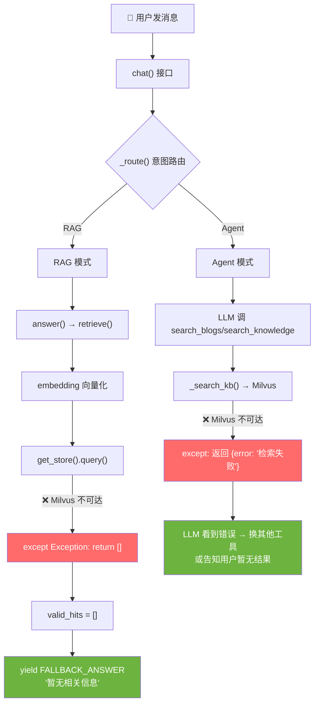
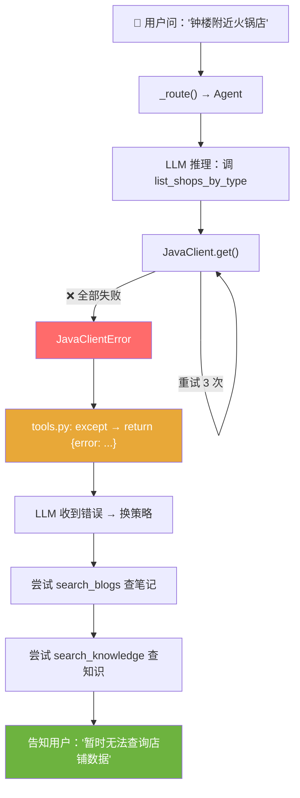
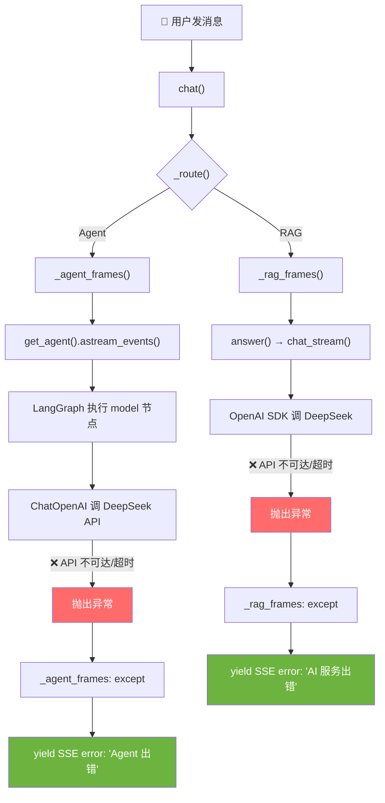

# 故障推演与降级策略

> 对应代码: `app/routers/chat.py` + `app/agent/tools.py` + `app/services/rag_service.py`

---

## 场景 1：Milvus 挂了

**推演过程**：
1. RAG 模式：`retrieve()` 调 Milvus → 异常 → `return []` → `valid_hits` 为空 → 返回兜底话术
2. Agent 模式：LLM 调用 `search_blogs`/`search_knowledge` → `_search_kb()` 异常 → 返回 `{error: "知识库检索失败"}` → LLM 看到错误后换用 Java 工具或告知用户

**代码验证**：`rag_service.py:28-29` + `tools.py:91-107`

**面试回答**："Milvus 挂了不影响服务可用性。RAG 模式检索返回空列表，触发阈值兜底，用户看到'暂无相关信息'而非 500 错误。Agent 模式工具返回结构化错误，LLM 会自动换用 Java 工具或诚实告知用户。运维同学重启 Milvus 后恢复，整个过程服务不中断。"

---

## 场景 2：Java 后端挂了

**推演过程**：
1. LLM 调用 `list_shops_by_type` → Java 不可达
2. `JavaClient._get_list()` 重试 3 次（指数退避 0.5s/1s/2s）→ 全部失败 → 抛 `JavaClientError`
3. 工具 `except JavaClientError` → 返回 `{error: "查询失败: ..."}`
4. LLM 看到错误 → 换用 Milvus 工具（`search_blogs`/`search_knowledge`）→ 如果有笔记数据，仍能给出部分回答
5. 如果所有工具都失败 → LLM 告知用户"暂时无法查询"

**代码验证**：`java_client.py:52-67` + `tools.py:38-39`

**面试回答**："Java 后端挂了，服务不会崩溃。Agent 每个工具都有 try/except，返回结构化错误给 LLM。LLM 收到错误后会换策略——比如用向量库的笔记数据替代。同时 JavaClient 有指数退避重试 3 次，偶发抖动对上层透明。最坏情况下，LLM 会诚实告知用户'暂时无法查询'，而不是报 500。"

---

## 场景 3：DeepSeek API 挂了

**推演过程**：
1. Agent 模式：`ChatOpenAI` 调 DeepSeek → 超时（60s）→ 抛异常 → `_agent_frames` 的 `except` 捕获 → SSE error 事件
2. RAG 模式：`chat_stream()` 调 DeepSeek → 超时（60s）→ 抛异常 → `_rag_frames` 的 `except` 捕获 → SSE error 事件
3. 两种模式都是走 SSE error 事件，不会裸断 HTTP 连接

**代码验证**：`graph.py:33-36`（timeout=60, max_retries=2） + `chat.py:99-100`

**面试回答**："DeepSeek API 挂了，用户会看到'AI 服务出错'的友好提示，而不是白屏或 500。ChatOpenAI 配置了 60s 超时和 2 次重试，能在 API 偶发超时时自动恢复。如果重试也失败，SSE 的 error 事件保证前端能正常渲染错误信息，HTTP 连接不会断开。可以配合 DeepSeek 官方的备用 endpoint 做多活切换。"

---

## 场景 4：session_store 内存溢出（大量用户并发）

**推演过程**：
1. 每个会话 `deque(maxlen=6)`，最多存 3 轮对话
2. 假设 10000 个并发用户，每条消息 200 字符 → 10000×6×200 = 12MB
3. 实际上 `deque` 自动淘汰旧消息，不会无限增长
4. 如果用户量到百万级，单机内存不够 → 升级为 Redis

**代码验证**：`session_store.py:13`（`MAX_ROUNDS=3`）、`deque(maxlen=6)`

**面试回答**："当前设计是单机内存，每会话最多 6 条消息，deque 自动淘汰。万人并发约 12MB 内存，完全够用。如果百万级用户，把 session_store 换成 Redis 即可——接口不变，上层代码无感知。这就是'依赖收敛在 service 层'的好处。"

---

## 场景 5：用户恶意输入（超长文本/注入攻击）

**推演过程**：
1. 用户发送 10000 字的小说 → 走到 Agent 或 RAG
2. RAG 模式：`_build_context` 有 `settings.rag_max_context_chars` 截断，不会超 token
3. Agent 模式：`recursion_limit=13` 防死循环，`timeout=60` 防超时
4. Prompt injection：system prompt 中没有 anti-injection 指令，但工具约束 + 阈值兜底 + 意图路由提供了纵深防御

**代码验证**：`graph.py:21`（MAX_TOOL_ROUNDS=6）、`rag_service.py:37`（截断）

**面试回答**："恶意输入有三层防御：① 输入层——意图路由，非任务型消息走 RAG 而非 Agent，减少工具调用面；② 执行层——recursion_limit 防死循环，timeout 防超时，context 截断防超 token；③ 输出层——工具只返回真实数据，LLM 无法编造。可以增强的是在 system prompt 中加入 anti-injection 的 meta-rule。"

---

## 场景 6：向量库数据过期（Java 新店已上架，Milvus 还在旧快照）

**推演过程**：
1. Java 上新了一家火锅店，但 Milvus 还没重新灌入
2. RAG 模式：向量库搜不到新店 → 用户获取不到新店信息
3. Agent 模式：LLM 优先调 Java 实时接口（`list_shops_by_type`），能查到新店
4. 这就是"时效性分层"的设计初衷

**面试回答**："这就是我们做时效性分层的原因。Agent 的 4 个 Java 工具查实时数据，不受向量库快照影响。RAG 模式确实依赖向量库时效性，但 RAG 主要用于知识问答，不是精确店铺查询。定期重灌向量库（定时任务 or 事件驱动）可以缩小这个窗口。"

---

## 各场景影响面速查表

| 故障 | RAG 模式影响 | Agent 模式影响 | 用户感知 | 恢复方式 |
|------|------------|--------------|---------|---------|
| Milvus 挂 | 兜底话术 | LLM 换工具或告知 | "暂无相关信息" | 重启 Milvus |
| Java 挂 | 不影响（RAG 不调 Java） | LLM 换用向量工具 | 部分功能降级 | 重启 Java |
| DeepSeek 挂 | 完全不可用 | 完全不可用 | "AI 服务出错" | 切备用 API/恢复 |
| 内存溢出 | 概率性丢失历史 | 概率性丢失历史 | 对话上下文丢失 | 加内存/换 Redis |
| 恶意输入 | 阈值兜底 | recursion_limit | 无影响 | 无需恢复 |
| 数据过期 | 搜不到新数据 | 不受影响（实时查） | RAG 信息不全 | 重灌向量库 |