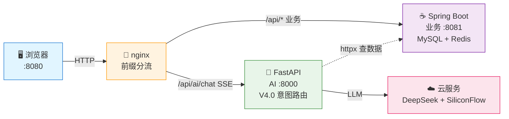

# 🏗 系统架构完整设计

> **本文档详细介绍长安文旅探店助手的系统架构、数据流和核心决策。**

## 目录

- [架构概览](#架构概览)
- [nginx 路由规则](#nginx-路由规则)
- [三大核心架构决策](#三大核心架构决策)
- [Java ↔ Python 协作关系](#java--python-协作关系)

---

## 架构概览

### 3 秒看懂

**nginx 网关分流 → Java 管业务 / Python 管 AI → DeepSeek + Milvus 智能增强**



---

## nginx 路由规则（流量怎么分）

| 路径前缀 | 目标 | 说明 |
|----------|------|------|
| `/` | nginx 静态资源 | 前端 HTML/CSS/JS |
| `/api/*` | Java :8081 | 业务 API |
| `/api/ai/chat` | Python :8000 | **SSE 流式直连** |
| `/api/ai/assist/*` | Java → Python | **Java 转发（需鉴权）** |

### nginx 配置关键点

```nginx
# SSE 流式透传配置（关键！）
location /api/ai/chat {
    proxy_pass http://127.0.0.1:8000;
    proxy_buffering off;  # 关闭缓冲，逐帧透传SSE事件
}
```

---

## 三大核心架构决策

### 决策 1: 流式走 nginx 直连，非流式走 Java 转发

**问题**: RestTemplate 会整体缓冲 SSE 流 → 用户等待 20 秒后一次性收到全文

**解决方案**: nginx `proxy_buffering off` 逐帧透传 + 前缀最长匹配自然分流

---

### 决策 2: Python 不直连 MySQL

**原因**: 规避内网连通性风险，Python 定位为「Java 之上的智能层」

**实现**: 所有数据经 Java REST API 获取（httpx 异步调用）

---

### 决策 3: 统一返回体 `{success, errorMsg, data, total}`

**原因**: 前端拦截器只认 `success` 字段，三种语言格式统一

---

## Java ↔ Python 协作关系

```
┌─────────────────────────────────────┐
│           Java 8081                  │
│ 店铺 / 笔记 / 用户 / 优惠券 / 秒杀   │
│ 缓存三防 / 分布式锁 / GEO 排序       │
└──────────────┬──────────────────────┘
               │ REST API (httpx)
               ▼
┌─────────────────────────────────────┐
│          Python 8000                 │
│ V4.0 意图路由 → RAG / Agent         │
│ 向量检索 / 多轮改写 / 重排 / 流式生成 │
└──────────────┬──────────────────────┘
               │
    ┌──────────┼──────────┐
    ▼          ▼          ▼
  DeepSeek  SiliconFlow  Milvus
```

---

## 相关文档

- [V4.0 意图路由详解](./V4_INTENT_ROUTING.md) - 核心创新：四代演进与防误判机制
- [面试问题汇总](./INTERVIEW_QA.md) - 架构设计相关面试题